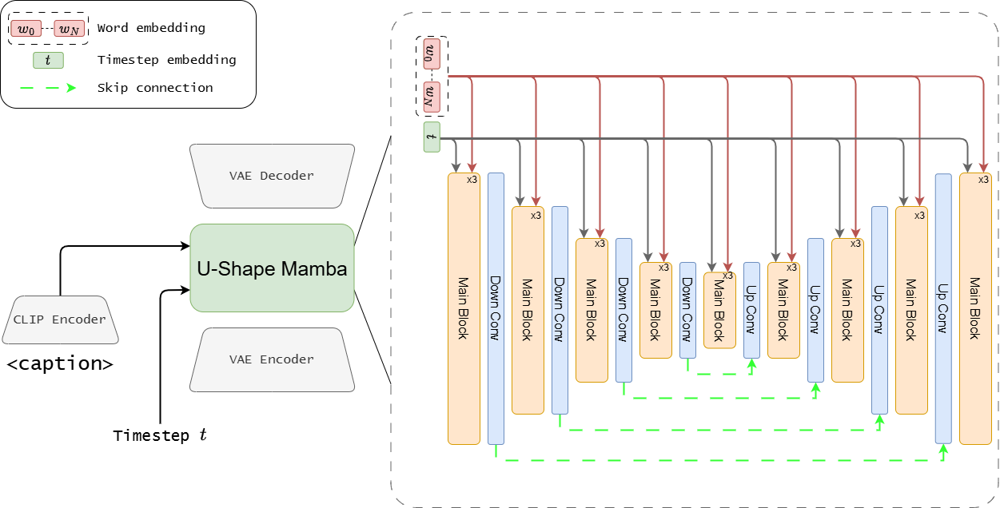

# U-Shape Mamba: State Space Model for faster diffusion

This is the official implementation of [U-Shape Mamba: State Space Model for faster diffusion](https://arxiv.org/abs/2504.13499)



U-Shape Mamba (USM) is a novel diffusion model that leverages Mamba-based layers within a U-Net-like hierarchical structure for high-quality image generation with significantly reduced computational costs. USM progressively reduces sequence length in the encoder and restores it in the decoder through Mamba blocks, achieving one-third the GFlops, less memory usage, and faster performance compared to Zigma (current state-of-the-art Mamba-based diffusion model) while improving image quality.

# Installation

To install the environment follow [DiT](https://github.com/facebookresearch/DiT) and [MambaIR](https://github.com/csguoh/MambaIR) env installation

# Training

```
accelerate launch train.py --model USM-B/1 --data-path  <data-path> \
         --batch_size 8 --num-classes 0 \
         --results_dir <dir> \
         --learn_pos_emb \
         --sample-every 20000 \
         --ckpt-every 10000 \
         --use_ckpt \
         --sampling log \
         --use_convtranspose \
         --skip_conn
```

# Sampling

```
accelerate launch sample.py --model USM-B/1 \
         --batch_size 2 --num-classes 0 \
         --learn_pos_emb \
         --use_convtranspose \
         --ckpt <ckpt-path>\
         --num_samples 1000 \
         --skip_conn
```

# Citation
If you use U-Shape Mamba in your research, please cite:
```
@misc{ergasti2025ushapemambastatespace,
      title={U-Shape Mamba: State Space Model for faster diffusion}, 
      author={Alex Ergasti and Filippo Botti and Tomaso Fontanini and Claudio Ferrari and Massimo Bertozzi and Andrea Prati},
      year={2025},
      eprint={2504.13499},
      archivePrefix={arXiv},
      primaryClass={cs.CV},
      url={https://arxiv.org/abs/2504.13499}, 
}
```

We thank [DiT](https://github.com/facebookresearch/DiT) and [MambaIR](https://github.com/csguoh/MambaIR) for their open code repository.